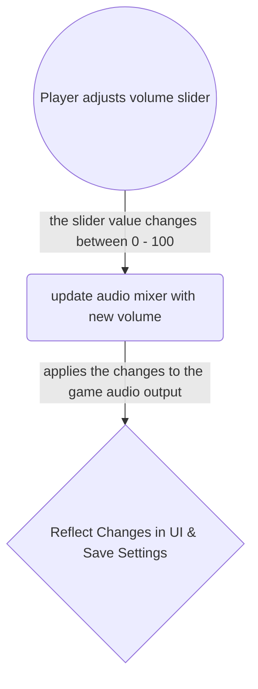
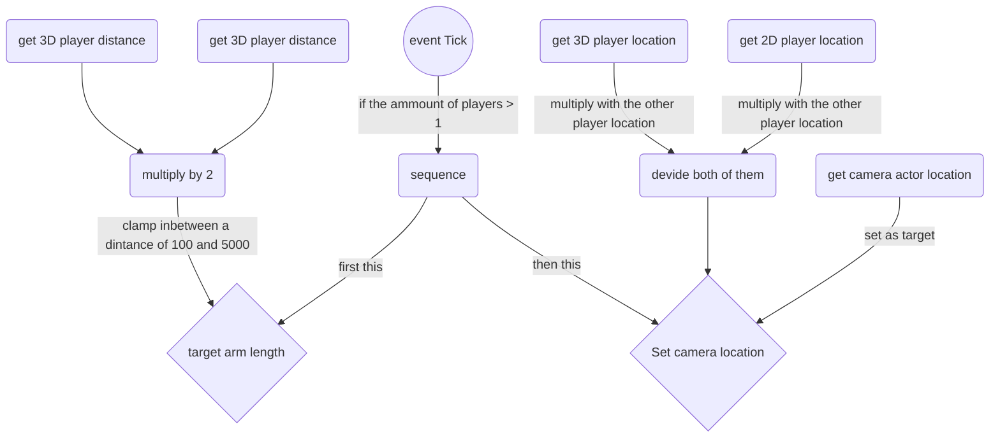
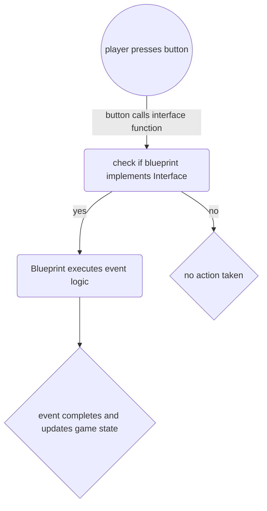

# ExamenRepository
welcome to the repository of our exam project called Sproutscape.

# our customer
Linx Interactive is a company founded by Edwin van Gessel. The goal of Linx is to create games that are not only fun to play but also have a positive impact on players. They aim to build a community where people interact with each other in a respectful and friendly manner. The games are designed to evoke positive emotions, such as joy and friendship. It’s not just about the game itself, but also about how it brings players together and helps them connect with others in a meaningful way.

# our assignment
The assignment is to create a local multiplayer game that centers on teamwork and positive emotions like friendship and pride. Players must support each other to progress—whether by reviving, healing, or solving puzzles together. Winning isn’t the focus; instead, the game is all about cooperation and mutual encouragement. Both players must always collaborate to move forward, fostering a strong sense of connection. To reinforce this, the game should reward their teamwork with positive feedback, making them feel proud of their shared achievements. Ultimately, the experience should emphasize connection, friendship, and the joy of building meaningful relationships.

A complete and detailed description can be found in the functional design.(part of the [wiki](https://github.com/spookyboy2000/SproutScape/wiki))

# Produced Game Parts

Bas Klaichid:
  * Roomba(lvl 1)
  * animation flip book for 2D
  * logic of animation for 3D
  * logic of animation for 2D
  * Audio slider

Edgar Rikkert:
  * Blueprint Interface for interaction
  * Centerpoint Camera
  * Washbot(lvl 1)
  * Interactable object
  * interactable object to hold

Nick van Luyk:
  * Local Co-op
  * Multiplayer
  * Button to press
  * Main menu
  * 2D player movement
  * packaging

## Roomba puzzle made by Bas Klaichid

When the Roomba is activated by the appointed interactive actor, it initiates its timeline, moving toward a designated point before returning to its original location. As it follows its path, the Roomba's collider checks for objects in front of it. When it collides with paper wads, its collider gradually shrinks them down, reducing their size until they disappear entirely. Once the Roomba finishes its path, the collider that stops the 3D player is destroyed, allowing them to continue playing the level.

## animation flip book for 2D made by Bas Klaichid

An Animation Flipbook in Unreal Engine is a 2D animation asset that plays a sequence of sprites (images) like a flipbook, creating the illusion of movement. It’s commonly used for 2D characters, effects (like explosions), or UI animations in Paper2D projects.

## logic of animation for 3D made by Bas Klaichid
This is the working logic for the 3D animation so that when the player jumps, runs, falls, and stand still the proper animation is played without wierd visual glitches

## logic of animation for 2D made by Bas Klaichid
This is the working logic for the 2D animation so that when the player jumps, runs, falls, and stand still the proper animation is played without wierd visual glitches and to make sure the sprite is able to move both ways.

## audio slider made by Bas Klaichid

We used a widget blueprint and give the slider a value ammount that would be adjusted to the volume itself. This made it so that we can adjùst the volume either in the main menu or in our pause menu.

## Centerpoint Camera by Edgar Rikkert

The Center-point camera  dynamically adjusts its position based on the locations of both players. The idea is to keep both players visible on the screen while maintaining a balanced view of the action.If the players move closer together, the camera can zoom in for a more detailed view. Conversely, if they spread apart, the camera zooms out to keep both in frame. The zoom level is often determined by the distance between the players. by letting this be funtion be fired on the Event Tick it ensures that the camera stays centered relative to both players.

### flowchart for the Centerpoint Camera

## the washbot made by Edgar Rikkert

If the button ontop the package box is pressed by the 3D player, the actor will finish it's animation in the paperFlipbook. After that the collider by the plate will appear which makes it so that the 2D player can move further throughout the level

## Blueprint Interface for interaction made by Edgar Rikkert

A Blueprint Interface is a convenient way to instansiate communication between different Blueprints without relying on hard references. This means that each Blueprint implementing the interface must define its own functions. For example, the InteractionHold function takes a float input that determines how long the interaction key is held, allowing the loading bar to update dynamically based on the duration of the press.

## Interactable object to hold made by Edgar Rikkert

The Interactable object to hold is made to highlight if a pawn gets into range of the collider. while it is highlighted the player can use the appropriate interaction, hold the key down or simply having to press it once. After it is activated the hold to interact actor will light up red and be flipped to the other side to indicate that it has been activated.

## Interactable object made by Edgar Rikkert

The Interactable object is also made to highlight if a pawn gets into range of the collider. The normal interactable object works a bit different then the interactable object to hold. Simply Pressing it once will fire off the event for the actor that has the blueprint interface.

## Button to press by Nick van Luyk

The button is an interactive actor designed to trigger a specified actor within the level. When a player steps on it, the button lowers and turns red, signaling that it has been pressed. Once activated, the designated actor—equipped with a blueprint interface—responds by executing its event. Selecting the target actor in the editor is simple: just choose the button and then click on the actor you want to link.

## Local Co-op made by Nick van Luyk

Local co-op in Unreal Engine 5 is built upon a combination of settings and systems that seamlessly integrate to create a cohesive multiplayer experience. To enable local co-op for two players, several steps need to be configured within the game. First we increased the number of players to two within the game mode settings. Next, two Player Start actors should be placed at the beginning of the map to define individual spawn points for each player. In the game mode blueprint, the Create Player node must be used twice to actually be able to use the additional player. Once the players are created, distinct input mappings should be assigned to their corresponding pawns. This ensures that each player has independent control over their character using separate gamepads.

## 2D Player Movement – Implemented by Nick van Luyk

The 2D player movement system is designed for responsive and intuitive control within a side-scrolling environment rendered in the background of the shared camera space. Movement is fully optimized for **controller (gamepad)** input.

### 🎮 Movement Overview

- **Horizontal Movement**:  
  Controlled via the **left analog stick** (left/right) or the **D-pad**. Movement uses velocity-based input for smooth transitions, supporting adjustable acceleration/deceleration curves.

- **Jumping**:  
  Activated with the **A button**. Includes:
  - Variable jump height depending on how long the button is held
  - Coyote time (a short grace period after leaving a ledge)
  - Jump buffering (registers jump input slightly before landing)

- **Interaction**:  
  Performed with the **X button**, enabling the player to:
  - Activate buttons/switches
  - Pick up or throw items across dimensions
  - Trigger co-op puzzle mechanics

### 🧠 Design Goals

- **Fluid Platforming**: Movement should feel responsive and snappy, with subtle mid-air control.
- **Co-op Synergy**: Designed with the 3D player's space in mind, encouraging team-based problem-solving.
- **Shared Camera Awareness**: Though positioned in the 2D background layer, the player remains visible from the shared camera with the 3D player.

### 🛠️ Implementation Details

- Built using Unreal Engine’s PaperZD with Blueprint scripting
- Tuned gravity and friction settings for responsive movement
