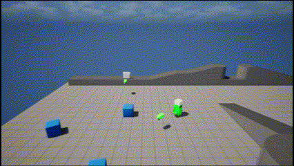
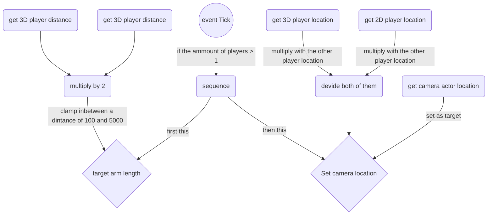

# ExamenRepository
welcome to the repository of our exam project called Sproutscape.

# our customer
Linx Interactive is a company founded by Edwin van Gessel. The goal of Linx is to create games that are not only fun to play but also have a positive impact on players. They aim to build a community where people interact with each other in a respectful and friendly manner. The games are designed to evoke positive emotions, such as joy and friendship. It’s not just about the game itself, but also about how it brings players together and helps them connect with others in a meaningful way.

# our assignment
The assignment is to create a local multiplayer game that centers on teamwork and positive emotions like friendship and pride. Players must support each other to progress—whether by reviving, healing, or solving puzzles together. Winning isn’t the focus; instead, the game is all about cooperation and mutual encouragement. Both players must always collaborate to move forward, fostering a strong sense of connection. To reinforce this, the game should reward their teamwork with positive feedback, making them feel proud of their shared achievements. Ultimately, the experience should emphasize connection, friendship, and the joy of building meaningful relationships.

A complete and detailed description can be found in the functional design.(part of the [wiki](https://github.com/spookyboy2000/SproutScape/wiki))

# Produced Game Parts

Bas Klachid:
  * Roomba(lvl 1)
  * Animation Blend spaces for 3D
  * Audio slider

Edgar Rikkert:
  * Blueprint Interface for interaction
  * Centerpoint Camera
  * Washbot(lvl 1)
  * items to Interact

Nick van Luyk:
  * Local Co-op
  * Multiplayer
  * Button to press
  * Main menu
  * 2D and 3D player movement
  * packaging

## Roomba puzzle made by Bas Klachid

When the Roomba is activated by the appointed interactive actor, it initiates its timeline, moving toward a designated point before returning to its original location. As it follows its path, the Roomba's collider checks for objects in front of it. When it collides with paper wads, its collider gradually shrinks them down, reducing their size until they disappear entirely. Once the Roomba finishes its path, the collider that stops the 3D player is destroyed, allowing them to continue playing the level.

## audio slider made by Bas Klachid

we used a widget blueprint and give the slider a value ammount that would be adjusted to the volume itself. This made it so that we can adjsut the volume either in the main menu or in our pause menu.

## Animation Blend spaces for 3D made by Bas Klachid

Contrary to popular belief, Lorem Ipsum is not simply random text. It has roots in a piece of classical Latin literature from 45 BC, making it over 2000 years old. Richard McClintock, a Latin professor at Hampden-Sydney College in Virginia, looked up one of the more obscure Latin words, consectetur, from a Lorem Ipsum passage, and going through the cites of the word in classical literature, discovered the undoubtable source. Lorem Ipsum comes from sections 1.10.32 and 1.10.33 of "de Finibus Bonorum et Malorum" (The Extremes of Good and Evil) by Cicero, written in 45 BC. This book is a treatise on the theory of ethics, very popular during the Renaissance. The first line of Lorem Ipsum, "Lorem ipsum dolor sit amet..", comes from a line in section 1.10.32.

## Centerpoint Camera by Edgar Rikkert

The Center-point camera  dynamically adjusts its position based on the locations of both players. The idea is to keep both players visible on the screen while maintaining a balanced view of the action.If the players move closer together, the camera can zoom in for a more detailed view. Conversely, if they spread apart, the camera zooms out to keep both in frame. The zoom level is often determined by the distance between the players. by letting this be funtion be fired on the Event Tick it ensures that the camera stays centered relative to both players.

### flowchart for the Centerpoint Camera

## the washbot made by Edgar Rikkert

Contrary to popular belief, Lorem Ipsum is not simply random text. It has roots in a piece of classical Latin literature from 45 BC, making it over 2000 years old. Richard McClintock, a Latin professor at Hampden-Sydney College in Virginia, looked up one of the more obscure Latin words, consectetur, from a Lorem Ipsum passage, and going through the cites of the word in classical literature, discovered the undoubtable source. Lorem Ipsum comes from sections 1.10.32 and 1.10.33 of "de Finibus Bonorum et Malorum" (The Extremes of Good and Evil) by Cicero, written in 45 BC. This book is a treatise on the theory of ethics, very popular during the Renaissance. The first line of Lorem Ipsum, "Lorem ipsum dolor sit amet..", comes from a line in section 1.10.32.

## Blueprint Interface for interaction made by Edgar Rikkert

Contrary to popular belief, Lorem Ipsum is not simply random text. It has roots in a piece of classical Latin literature from 45 BC, making it over 2000 years old. Richard McClintock, a Latin professor at Hampden-Sydney College in Virginia, looked up one of the more obscure Latin words, consectetur, from a Lorem Ipsum passage, and going through the cites of the word in classical literature, discovered the undoubtable source. Lorem Ipsum comes from sections 1.10.32 and 1.10.33 of "de Finibus Bonorum et Malorum" (The Extremes of Good and Evil) by Cicero, written in 45 BC. This book is a treatise on the theory of ethics, very popular during the Renaissance. The first line of Lorem Ipsum, "Lorem ipsum dolor sit amet..", comes from a line in section 1.10.32.

## items to Interact made by Edgar Rikkert

Contrary to popular belief, Lorem Ipsum is not simply random text. It has roots in a piece of classical Latin literature from 45 BC, making it over 2000 years old. Richard McClintock, a Latin professor at Hampden-Sydney College in Virginia, looked up one of the more obscure Latin words, consectetur, from a Lorem Ipsum passage, and going through the cites of the word in classical literature, discovered the undoubtable source. Lorem Ipsum comes from sections 1.10.32 and 1.10.33 of "de Finibus Bonorum et Malorum" (The Extremes of Good and Evil) by Cicero, written in 45 BC. This book is a treatise on the theory of ethics, very popular during the Renaissance. The first line of Lorem Ipsum, "Lorem ipsum dolor sit amet..", comes from a line in section 1.10.32.

## Button to press by Nick van Luyk

The button is an interactive actor designed to trigger a specified actor within the level. When a player steps on it, the button lowers and turns red, signaling that it has been pressed. Once activated, the designated actor—equipped with a blueprint interface—responds by executing its event. Selecting the target actor in the editor is simple: just choose the button and then click on the actor you want to link.

## Local Co-op made by Nick van Luyk

Local co-op in Unreal Engine 5 is built upon a combination of settings and systems that seamlessly integrate to create a cohesive multiplayer experience. To enable local co-op for two players, several steps need to be configured within the game. First we increased the number of players to two within the game mode settings. Next, two Player Start actors should be placed at the beginning of the map to define individual spawn points for each player. In the game mode blueprint, the Create Player node must be used twice to actually be able to use the additional player. Once the players are created, distinct input mappings should be assigned to their corresponding pawns. This ensures that each player has independent control over their character using separate gamepads.

## Multiplayer spaces made by Nick van Luyk

Contrary to popular belief, Lorem Ipsum is not simply random text. It has roots in a piece of classical Latin literature from 45 BC, making it over 2000 years old. Richard McClintock, a Latin professor at Hampden-Sydney College in Virginia, looked up one of the more obscure Latin words, consectetur, from a Lorem Ipsum passage, and going through the cites of the word in classical literature, discovered the undoubtable source. Lorem Ipsum comes from sections 1.10.32 and 1.10.33 of "de Finibus Bonorum et Malorum" (The Extremes of Good and Evil) by Cicero, written in 45 BC. This book is a treatise on the theory of ethics, very popular during the Renaissance. The first line of Lorem Ipsum, "Lorem ipsum dolor sit amet..", comes from a line in section 1.10.32.

## Main menu made by Nick van Luyk

Contrary to popular belief, Lorem Ipsum is not simply random text. It has roots in a piece of classical Latin literature from 45 BC, making it over 2000 years old. Richard McClintock, a Latin professor at Hampden-Sydney College in Virginia, looked up one of the more obscure Latin words, consectetur, from a Lorem Ipsum passage, and going through the cites of the word in classical literature, discovered the undoubtable source. Lorem Ipsum comes from sections 1.10.32 and 1.10.33 of "de Finibus Bonorum et Malorum" (The Extremes of Good and Evil) by Cicero, written in 45 BC. This book is a treatise on the theory of ethics, very popular during the Renaissance. The first line of Lorem Ipsum, "Lorem ipsum dolor sit amet..", comes from a line in section 1.10.32.

## 2D and 3D player movement made by Nick van Luyk

Contrary to popular belief, Lorem Ipsum is not simply random text. It has roots in a piece of classical Latin literature from 45 BC, making it over 2000 years old. Richard McClintock, a Latin professor at Hampden-Sydney College in Virginia, looked up one of the more obscure Latin words, consectetur, from a Lorem Ipsum passage, and going through the cites of the word in classical literature, discovered the undoubtable source. Lorem Ipsum comes from sections 1.10.32 and 1.10.33 of "de Finibus Bonorum et Malorum" (The Extremes of Good and Evil) by Cicero, written in 45 BC. This book is a treatise on the theory of ethics, very popular during the Renaissance. The first line of Lorem Ipsum, "Lorem ipsum dolor sit amet..", comes from a line in section 1.10.32.

